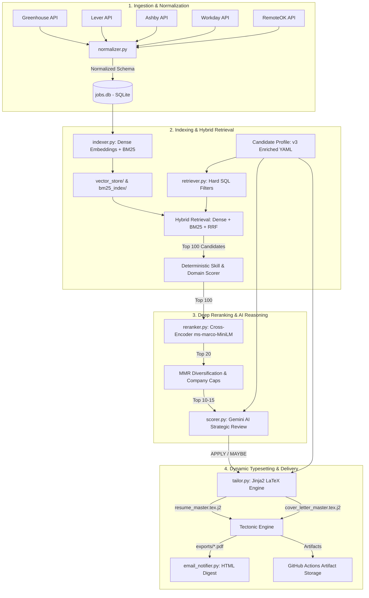
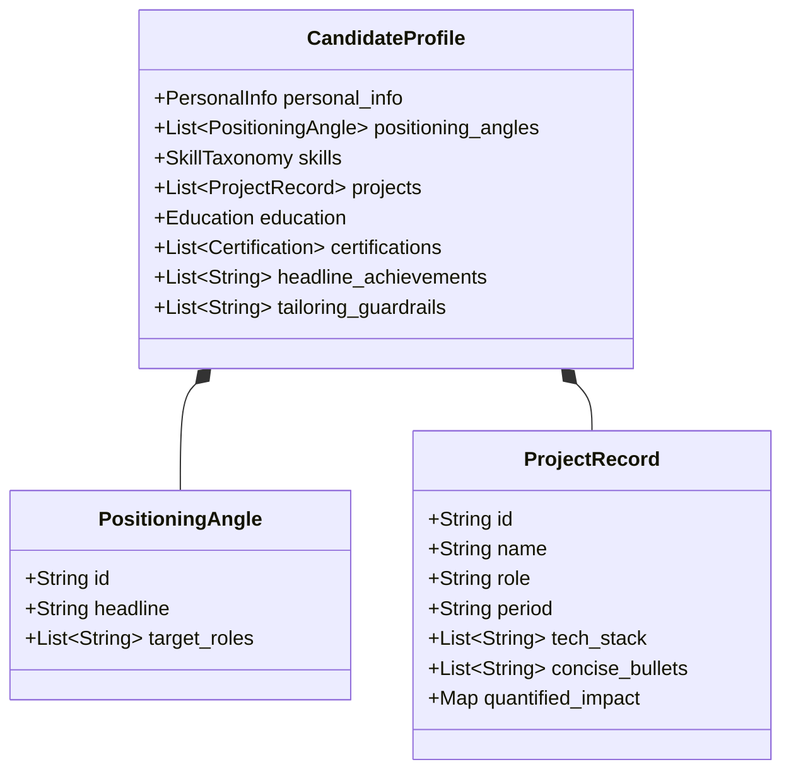

# Job Discovery & Application Assistant — System Architecture & Engineering Guide

## Executive Summary

The **Job Discovery & Application Assistant** is a local-first, cloud-ready, automated AI retrieval and document synthesis engine. Designed to solve the friction of discovering high-signal technical roles and tailoring application materials, the platform autonomously ingests daily postings from enterprise ATS boards (Greenhouse, Lever, Ashby, Workday, RemoteOK), normalizes semi-structured job specifications, performs high-recall hybrid information retrieval, executes deep Cross-Encoder reranking and MMR diversification, runs bounded LLM strategic reviews, and typesets custom ATS-optimized LaTeX resumes and cover letters via **Jinja2** and the **Tectonic** typesetting engine.

The platform executes entirely unattended via **GitHub Actions** on a daily schedule, emailing a curated digest with compiled PDF attachments directly to the applicant's inbox.

---

## High-Level System Architecture

---

## Core Engineering Stages

### Stage 1: Ingestion & Deterministic Normalization
* **Targeted API Ingestion (`scraper.py`)**: Connects directly to verified company job boards using native REST APIs and endpoints rather than fragile web scrapers.
* **Schema Normalization (`normalizer.py`)**:
  * Extracts structured metadata: Canonical role family, seniority boundaries (`min_years`, `max_years`), remote eligibility, location, and salary ranges.
  * Normalizes technical skills against an enterprise taxonomy of 150+ canonical tags (e.g. mapping `Python3`, `py`, `python` to `Python`; `Snowpark`, `Snowflake DB` to `Snowflake`).
  * Enforces an **anti-empty description contract**: records missing raw job text are flagged or hydrated before database persistence.

### Stage 2: Incremental Indexing & Hybrid Retrieval
* **Incremental Indexing (`indexer.py`)**:
  * **Dense Semantic Index**: Computes sentence embeddings using `sentence-transformers/all-MiniLM-L6-v2`.
  * **Sparse Lexical Index**: Builds term-frequency Okapi BM25 indices across canonical skill vectors.
  * **Efficiency**: Uses SHA-256 content hashing to index only newly added or modified job records.
* **Multi-Layer Hybrid Retrieval (`retriever.py`)**:
  * **Deterministic Hard Filters**: Drops roles exceeding experience caps (> 5 years), requiring on-site presence outside preferred geographies, or matching excluded functions (e.g., Sales, HR, Legal).
  * **Reciprocal Rank Fusion (RRF)**: Combines dense vector similarity and sparse BM25 scores:
    $$RRF(d) = \sum_{m \in M} \frac{1}{k + r_m(d)}$$
  * **Deterministic Scoring Layer**: Evaluates role intent alignment (20%), domain fit (10%), dense embeddings (25%), BM25 (15%), and required skill overlap (20%) to produce the **Top 100** candidate set.

### Stage 3: Cross-Encoder Reranking & MMR Diversification
* **Cross-Encoder Reranking (`reranker.py`)**:
  * Passes the concatenated `(Candidate Profile, Job Description)` pairs through `ms-marco-MiniLM-L-6-v2`.
  * Evaluates deep pairwise cross-attention interactions that bi-encoders miss, filtering the candidate pool from **Top 100** to **Top 20**.
* **Maximal Marginal Relevance (MMR) & Anti-Clustering**:
  * Applies MMR diversification across job representations to ensure variety in recommendations.
  * Enforces company-level caps ($\le 2$ roles per employer) to prevent one company's mass hiring from saturating the results, yielding a balanced **Top 10–15** set.

### Stage 4: Strategic AI Review & Bounded LLM Reasoning
* **Complexity Reduction ($O(N) \to O(K)$)**:
  * Instead of querying expensive LLMs on hundreds of raw scrapes, LLM evaluation runs exclusively on the top $K$ candidates ($K \le 15$).
* **Strategic Review (`scorer.py`)**:
  * Leverages **Google Gemini Flash** with strict JSON schemas.
  * Evaluates structured criteria: Candidate strengths, missing requirements, critical qualification blockers, and qualitative match reasoning.
  * Outputs a blended composite score combining deterministic retrieval, cross-encoder confidence, and LLM reasoning.

### Stage 5: Dynamic Jinja2 LaTeX Typesetting Engine
* **Template Architecture (`tailor.py` & `templates/`)**:
  * Configured with custom delimiters to prevent collisions with native LaTeX syntax:
    * Blocks: `\BLOCK{ ... }`
    * Variables: `\VAR{ ... }`
    * Comments: `\#{ ... }`
* **Dynamic Content Injection**:
  1. **Dynamic Target Headline**: Automatically switches the resume header to match role requirements (e.g., *Data Scientist | Predictive Modeling | Machine Learning | GenAI* vs. *Data Engineer | Snowflake Platform Engineering | GenAI & Agentic AI Systems*).
  2. **Tailored Professional Summary**: Injects an LLM-crafted 3–4 sentence hook specifically referencing the target company and alignment points.
  3. **Strict Reverse-Chronological Factspan Experience**:
     * **Project 1 (Current)**: *Snowflake Cost Optimization Agent* (May 2026 – Present)
     * **Project 2 (Preceding)**: *AI-Powered Network Incident Orchestrator* (Jan 2026 – Present)
     * **Project 3 (Foundational)**: *Customer 360 Data Mesh & Governance Platform* (Sep 2023 – Dec 2025)
  4. **Cover Letter Generator**: Renders `templates/cover_letter_master.tex.j2` into a dedicated 1-page business letter.
* **Compilation (`tectonic.exe`)**:
  * Self-contained, sandboxed compilation using the **Tectonic** modern XeTeX engine.
  * Produces ATS-friendly, pristine 2-page PDF resumes and 1-page PDF cover letters in `exports/`.

### Stage 6: Delivery & Operations
* **Daily Email Digest (`email_notifier.py`)**:
  * Assembles a structured, responsive HTML digest of Top 10 recommendations.
  * Attaches both `Sourav_Resume_<company>_<id>.pdf` and `Sourav_Cover_Letter_<company>_<id>.pdf` directly to the email.
* **CI/CD Automation (`.github/workflows/daily_jobs.yml`)**:
  * Scheduled daily via GitHub Actions cron at **3:30 AM UTC (9:00 AM IST)**.
  * Uploads all compiled PDFs to GitHub Workflow Artifacts (`actions/upload-artifact@v4`).
  * Keeps Git history clean by ignoring binary databases and generated PDFs via `.gitignore`.

---

## Single Source of Truth: Candidate Profile Engine

The system's core knowledge base is maintained in `Sourav_Ray_Enriched_Profile_v3.yaml`.

### Ethical Grounding & Anti-Fabrication Rules
1. **Zero Hallucination Guarantee**: The LLM prompt explicitly constrains generation: no tools, metrics, dates, or responsibilities outside the YAML profile may be invented.
2. **Context Distinction**: Independent open-source projects (such as this Job Discovery Assistant) are strictly labeled as `(Independent, GitHub)` to maintain clear boundaries with employer experience at Factspan Analytics.
3. **Metric Anchor Preservation**: Core proof points (**65%** Snowflake compute-cost reduction, **60%** MTTD / **65%** MTTR reduction, **80%** modeling effort cut) are preserved across all generated variants.

---

## Technology Stack

| Layer | Technologies |
| :--- | :--- |
| **Language & Runtime** | Python 3.11+, PowerShell |
| **Ingestion & Sourcing** | Greenhouse API, Lever API, Ashby API, Workday REST, RemoteOK API, `requests` |
| **Data Persistence** | SQLite (`jobs.db`), PyYAML, stdlib `tomllib` |
| **Information Retrieval** | `sentence-transformers` (`all-MiniLM-L6-v2`), `rank-bm25`, Reciprocal Rank Fusion |
| **Reranking & Selection** | Cross-Encoder (`ms-marco-MiniLM-L-6-v2`), Maximal Marginal Relevance (MMR) |
| **Reasoning & Synthesis** | Google Gemini 2.5/3 Flash (`llm_client.py`), Structured JSON output mode |
| **Typesetting & Templating**| Jinja2 (LaTeX delimiter configuration), Tectonic (Modern XeTeX compiler) |
| **Notification & Delivery** | Python standard library `smtplib`, `email.mime` (Gmail SMTP over TLS) |
| **DevOps & Automation** | GitHub Actions, Git, Linux / Windows CI workflows |

---

## Summary of Architectural Wins

1. **Deterministic Speed**: Ingestion, normalization, and hybrid retrieval run in under 45 seconds without making expensive LLM calls on irrelevant listings.
2. **True Dynamic Customization**: Replaced static string replacements with a real Jinja2 LaTeX engine, producing tailored resumes and cover letters for every opportunity.
3. **Clean Repository Hygiene**: Binary databases and compiled PDFs are routed to workflow artifacts, preventing Git repository bloat and merge conflicts.
4. **Resilient Offline Architecture**: Operates locally on Windows and scales automatically on Linux-based GitHub Actions runners with identical output fidelity.
