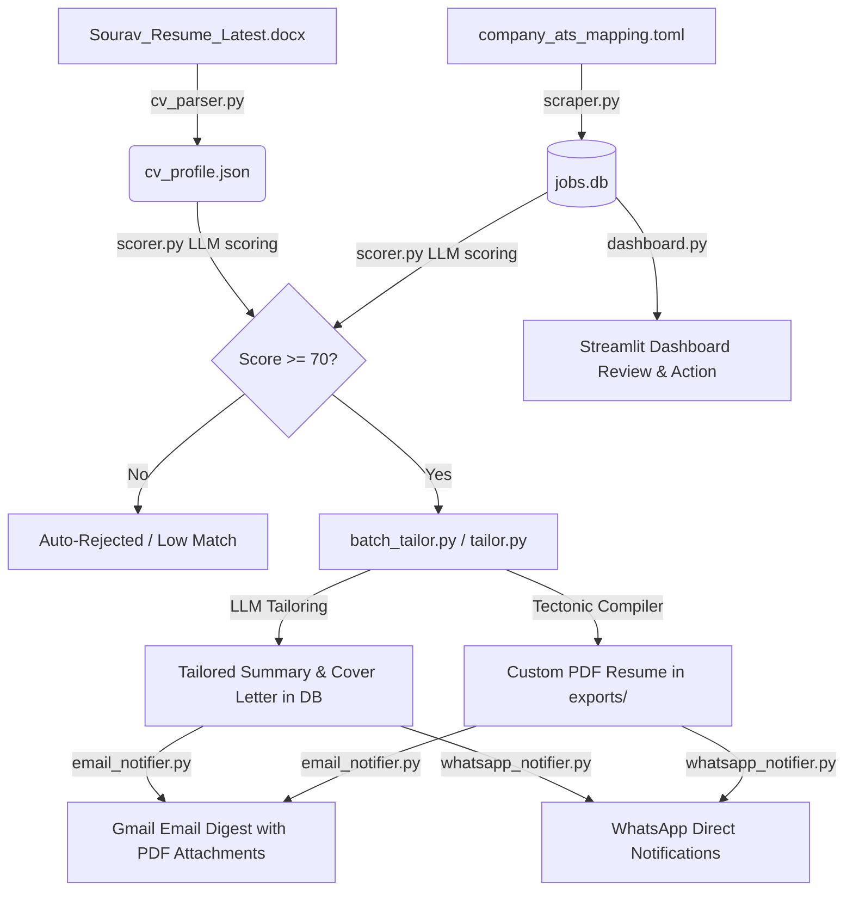

# 💼 Job Discovery & Application Assistant

An automated, local-first system designed to scrape job openings from public applicant tracking systems (Greenhouse, Lever, Workday) and job boards (RemoteOK, Naukri, LinkedIn), evaluate match suitability against a candidate's resume using Large Language Models (LLMs), generate tailored cover letters and LaTeX PDF resumes, and deliver digest notifications via Email and WhatsApp.

---

## 🏗️ System Architecture & Workflow

The assistant coordinates multiple specialized components through a SQLite database to ingest, score, tailor, and notify. Below is the system flow:



---

## 🌟 Key Features

*   **Resume Parser ([cv_parser.py](./cv_parser.py))**: Extracts raw text from DOCX or PDF resumes using `pdfplumber` and `python-docx`. Uses an LLM (local Ollama or Google Gemini) to structure it into a normalized candidate profile schema ([cv_profile.json](./cv_profile.json)).
*   **Job Scraper ([scraper.py](./scraper.py))**:
    *   Queries Greenhouse, Lever, RemoteOK, Workday, Naukri, and LinkedIn.
    *   Resolves company-specific board slugs automatically by referencing the central mappings defined in [company_ats_mapping.toml](./company_ats_mapping.toml).
    *   Checks job listings against target experience, roles, and locations (e.g., preferring India/Remote while filtering out foreign geographical constraints).
    *   Stores scraped opportunities in a local SQLite database ([jobs.db](./jobs.db)).
*   **AI Match Scorer ([scorer.py](./scorer.py))**:
    *   Scores raw job descriptions against the candidate's JSON profile using LLMs.
    *   Evaluates fit from `0` to `100` based on skills overlap, experience, seniority, and location constraints.
    *   Provides structured reasoning, lists matching strengths, and identifies missing requirements.
*   **Resume & Cover Letter Tailoring ([tailor.py](./tailor.py) & [batch_tailor.py](./batch_tailor.py))**:
    *   Dynamically drafts high-impact, ATS-optimized summaries and 3-paragraph cover letters without fabricating qualifications.
    *   Compiles a custom, job-specific PDF resume using the local LaTeX compiler [tectonic.exe](./tectonic.exe), automatically embedding the tailored professional summary.
*   **Multi-Channel Notifications**:
    *   **Daily Email Digest ([email_notifier.py](./email_notifier.py))**: Dispatches structured, responsive HTML digests directly to the user's Gmail. Auto-attaches corresponding tailored PDF resumes from the `exports/` folder.
    *   **WhatsApp Dispatcher ([whatsapp_notifier.py](./whatsapp_notifier.py))**: Provides direct notifications via CallMeBot API or Twilio API containing match scores, role descriptions, and repository PDF links.
*   **Streamlit Review Dashboard ([dashboard.py](./dashboard.py))**:
    *   Displays metrics (Total Listings, Unscored Jobs, To Review, Applied, Rejected).
    *   Allows text searching, filtering by minimum match scores, status, and sources.
    *   Provides interface to inspect job details, read generated summaries/letters, update application status, and trigger tailoring or PDF compiles on demand.

---

## 🛠️ Prerequisites & Setup

### 1. Python Environment
This project runs on Python 3.11+. Install dependencies:
```bash
pip install -r requirements.txt
```

### 2. Large Language Model Configuration
The unified LLM client ([llm_client.py](./llm_client.py)) supports both local and cloud-based models:
*   **Local (Development)**: Install [Ollama](https://ollama.com/) and pull your chosen model (e.g., `llama3.2:3b` or `qwen2.5:14b`):
    ```bash
    ollama pull llama3.2:3b
    ```
*   **Cloud (Production / CI)**: Obtain a free Gemini API key from [Google AI Studio](https://aistudio.google.com/apikey). Set it in your environment:
    ```bash
    set GEMINI_API_KEY=your_api_key_here
    ```

### 3. LaTeX Engine (Tectonic)
The resume generator uses the **Tectonic** LaTeX engine.
*   **Windows**: A precompiled standalone binary `tectonic.exe` is included in the project directory.
*   **Other Platforms**: The system expects `tectonic` to be available in your system `PATH`, or set up through the GitHub Actions setup step.

### 4. Configuration File ([config.toml](./config.toml))
Customize config values inside [config.toml](./config.toml):
*   Specify target role names, locations, and experience criteria.
*   Configure the scoring threshold (default is `70`).
*   Set up Greenhouse and Lever board company list mappings.
*   Add email settings (`sender_email`, `recipient_email`, and `gmail_app_password`).

---

## 🚀 Execution Guide

You can run individual pipeline stages manually, or execute the entire workflow together.

### Run the Full Pipeline
To fetch new jobs, score them, run batch tailoring, and send notifications sequentially:
```bash
python run_pipeline.py
```

### Run Pipeline Stages Separately

1.  **Parse CV Resume (Once or when CV changes)**
    ```bash
    python cv_parser.py --cv d:/Projects/job-discovery-assistant/Sourav_Resume_Latest.docx
    ```
    This generates the structured candidate profile at [cv_profile.json](./cv_profile.json).

2.  **Scrape Job Openings**
    ```bash
    # Scrape all configured sources
    python scraper.py
    
    # Scrape Greenhouse boards only
    python scraper.py --source greenhouse
    ```
    Fetched jobs are saved to [jobs.db](./jobs.db).

3.  **Run Match Scorer**
    ```bash
    python scorer.py
    ```
    Evaluates unscored listings in the DB and marks those scoring below the threshold as `rejected`.

4.  **Batch Tailor Qualified Jobs**
    ```bash
    # Tailor top 10 qualified jobs in the DB
    python batch_tailor.py --top 10
    ```
    Saves tailored professional summaries, drafts cover letters, and compiles LaTeX PDFs to the `exports/` folder.

5.  **Trigger Notifications manually**
    ```bash
    # Send daily email digest with PDF resume attachments
    python email_notifier.py
    
    # Send daily WhatsApp digest via CallMeBot or Twilio
    python whatsapp_notifier.py
    ```

---

## 🖥️ Streamlit Interactive Dashboard

To review fetched listings, read match justifications, update statuses, or generate customized material on demand, start the Streamlit app:
```bash
streamlit run dashboard.py
```

---

## 🤖 Continuous Integration (GitHub Actions)

The repository includes a daily automation workflow at [.github/workflows/daily_jobs.yml](./.github/workflows/daily_jobs.yml):
*   **Trigger**: Runs on schedule daily at **3:30 AM UTC (9:00 AM IST)** or can be dispatched manually.
*   **Workflow steps**:
    1.  Checks out the codebase and configures Python 3.11.
    2.  Installs the Tectonic LaTeX compiler.
    3.  Scores new jobs using Gemini AI.
    4.  Batch-tailors resume drafts and compiles the PDFs.
    5.  Emails the daily HTML digest with the PDFs attached.
    6.  Commits the updated [jobs.db](./jobs.db) and tailored PDF resumes in `exports/` back to the GitHub repository automatically.
*   **Required Secrets**:
    *   `GEMINI_API_KEY`: Google Gemini API Key.
    *   `SENDER_EMAIL` / `RECIPIENT_EMAIL`: Gmail account credentials.
    *   `GMAIL_APP_PASSWORD`: Gmail 16-character App Password.
