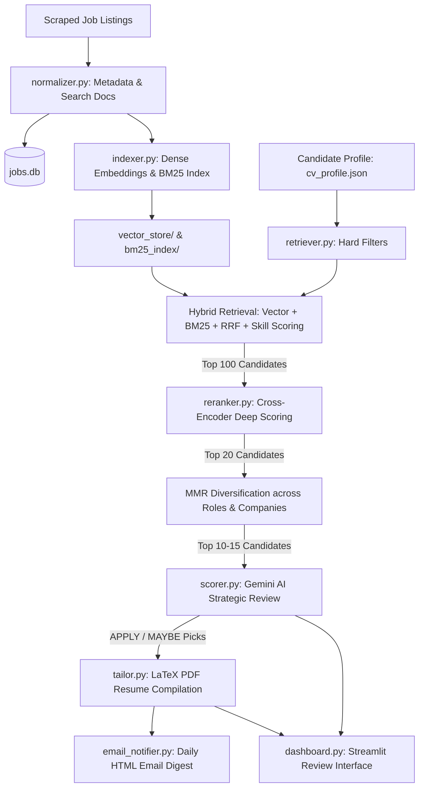

# 💼 Job Discovery & Application Assistant (Retrieval-First Engine)

A scalable, local-first and cloud-ready job discovery engine designed to scrape public ATS boards (Greenhouse, Lever, Workday, RemoteOK, Naukri, LinkedIn), normalize structured metadata, perform high-recall hybrid retrieval (Dense Vector + BM25 + RRF + Deterministic Scoring), execute deep Cross-Encoder reranking and MMR diversification, run Gemini AI strategic reviews on top picks only, generate tailored LaTeX resumes, and dispatch email/WhatsApp digests.

---

## 🏗️ Retrieval-First Architecture & Workflow



---

## 🌟 Key Features & Pipeline Stages

1. **Job Normalization ([`normalizer.py`](./normalizer.py))**: Extracts canonical technical skills (150+ tech taxonomy), experience boundaries (`min/max`), role family, domain, remote status, and builds concise high-signal search documents without calling LLMs.
2. **Incremental Indexing ([`indexer.py`](./indexer.py))**: Computes dense sentence embeddings (`all-MiniLM-L6-v2`) and builds term-frequency weighted BM25 indices. Embeds only new or modified jobs.
3. **Hard Filtering & Hybrid Retrieval ([`retriever.py`](./retriever.py))**:
   - Eliminates out-of-range experience, foreign on-site constraints, and excluded role titles deterministically.
   - Executes dense vector search and BM25 exact skill search.
   - Fuses rankings with Reciprocal Rank Fusion (RRF).
   - Computes deterministic alignment scores emphasizing **Role Intent & Career Trajectory (20%)**, **Domain Fit (10%)**, Dense Vector (25%), BM25 (15%), Required Skills (20%), Preferred Skills (5%), and Experience (5%) to return the **Top 100** candidates.
4. **Cross-Encoder Reranking & MMR Diversification ([`reranker.py`](./reranker.py))**:
   - Runs deep pairwise cross-attention (`ms-marco-MiniLM-L-6-v2`) to isolate the **Top 20** highest-relevance jobs.
   - Applies Maximal Marginal Relevance (MMR) and company caps ($\le 2$ per company) to eliminate clustering and select a diverse **Top 10–15**.
5. **AI Strategic Review & Blended Scoring ([`scorer.py`](./scorer.py))**:
   - Bounded Evaluation: Reduces LLM calls from $O(N)$ to $O(K)$, where $K$ is the bounded final candidate set ($K \ll N$, e.g., $10\text{--}20$ calls whether $N = 420$ or $10,000$).
   - Calculates a blended **Final Composite Score**:
     $$\text{Final} = 0.25 \times \text{Retrieval} + 0.35 \times \text{Reranker} + 0.40 \times \text{LLM}$$
     ensuring Gemini reasons and explains without overwriting the deterministic retrieval backbone.
6. **Information Retrieval Evaluation Suite ([`evaluate.py`](./evaluate.py))**:
   - Benchmarks retrieval and ranking quality using standard IR metrics: `Recall@100`, `Recall@20`, `NDCG@10`, `NDCG@20`, `Precision@10`, and `MRR`.
   - Compares baseline embeddings and tunes hyperparameter weights against ground-truth ratings.
7. **Resume & Cover Letter Tailoring ([`tailor.py`](./tailor.py))**:
   - Generates ATS-optimized professional summaries and cover letter drafts strictly grounded in candidate profile.
   - Compiles custom LaTeX PDF resumes with the local `tectonic` engine into `exports/`.
8. **Daily Email Digest ([`email_notifier.py`](./email_notifier.py))**:
   - Sends dark-mode HTML email digests with attached tailored PDF resumes directly to your inbox.
9. **Interactive Review Dashboard with Ground Truth Labeling ([`dashboard.py`](./dashboard.py))**:
   - Visualizes full funnel metrics, transparent score breakdowns (Semantic, BM25, Skill Match, Cross-Encoder, AI Review, Blended Final), and includes an interactive 1–5★ relevance labeling widget for continuous tuning.


---

## 🛠️ Prerequisites & Setup

### 1. Python Environment
This project runs on Python 3.11+. Install dependencies:
```bash
pip install -r requirements.txt
```

### 2. Large Language Model Configuration
The unified LLM client ([llm_client.py](./llm_client.py)) supports both local and cloud-based models:
*   **Local (Development)**: Install [Ollama](https://ollama.com/) and pull your chosen model (e.g., `llama3.2:3b` or `qwen2.5:14b`):
    ```bash
    ollama pull llama3.2:3b
    ```
*   **Cloud (Production / CI)**: Obtain a free Gemini API key from [Google AI Studio](https://aistudio.google.com/apikey). Set it in your environment:
    ```bash
    set GEMINI_API_KEY=your_api_key_here
    ```

### 3. LaTeX Engine (Tectonic)
The resume generator uses the **Tectonic** LaTeX engine.
*   **Windows**: A precompiled standalone binary `tectonic.exe` is included in the project directory.
*   **Other Platforms**: The system expects `tectonic` to be available in your system `PATH`, or set up through the GitHub Actions setup step.

### 4. Configuration File ([config.toml](./config.toml))
Customize config values inside [config.toml](./config.toml):
*   Specify target role names, locations, and experience criteria.
*   Configure the scoring threshold (default is `70`).
*   Set up Greenhouse and Lever board company list mappings.
*   Add email settings (`sender_email`, `recipient_email`, and `gmail_app_password`).

---

## 🚀 Execution Guide

You can run individual pipeline stages manually or execute the entire workflow together.

### Run the Full Pipeline
To fetch new jobs, normalize metadata, index vectors/BM25, perform hybrid retrieval, rerank with Cross-Encoder, review top picks with Gemini AI, batch tailor, and send notifications:
```bash
python run_pipeline.py
```

### Run Pipeline Stages Separately

1. **Scrape Job Openings**
   ```bash
   python scraper.py
   ```
   Saves raw job listings to [`jobs.db`](./jobs.db).

2. **Deterministic Metadata Normalization & Search Doc Creation**
   ```bash
   python normalizer.py
   ```
   Extracts canonical skills, experience requirements, role families, domains, and formats concise search documents.

3. **Incremental Dense Vector & BM25 Indexing**
   ```bash
   python indexer.py
   ```
   Embeds new listings into `vector_store/` and builds keyword index in `bm25_index/`.

4. **Hybrid Retrieval (Hard Filters + Dense Vector + BM25 + RRF)**
   ```bash
   python retriever.py
   ```
   Eliminates disqualified jobs and scores the **Top 100** candidates into `candidate_job_scores`.

5. **Cross-Encoder Reranking & MMR Diversification**
   ```bash
   python reranker.py
   ```
   Runs deep pairwise cross-attention (`Top 20`) and selects diverse, non-clustering openings (`Top 10–15`).

6. **Strategic AI Review (Gemini AI)**
   ```bash
   python scorer.py
   ```
   Evaluates **only** the top MMR-diversified candidates and outputs structured `APPLY`/`MAYBE`/`SKIP` classifications.

7. **Batch Tailor Resumes & Compile LaTeX PDFs**
   ```bash
   python tailor.py --batch --top 10
   ```
   Drafts tailored summaries/cover letters and compiles LaTeX PDF resumes into `exports/`.

8. **Trigger Email Notification**
   ```bash
   python email_notifier.py
   ```

---

## 🖥️ Streamlit Interactive Dashboard

To inspect the retrieval funnel, review multi-stage alignment breakdowns, update statuses, or generate tailored application materials on demand:
```bash
streamlit run dashboard.py
```

---

## 🤖 Continuous Integration (GitHub Actions)

The repository includes an automated workflow at [`.github/workflows/daily_jobs.yml`](./.github/workflows/daily_jobs.yml):
* **Trigger**: Daily at **3:30 AM UTC (9:00 AM IST)** or on-demand via `workflow_dispatch`.
* **Workflow Execution**:
  1. Checks out repository and provisions Python 3.11 + Tectonic compiler.
  2. Scrapes new jobs via `scraper.py`.
  3. Normalizes structured metadata via `normalizer.py`.
  4. Indexes embeddings and BM25 keywords via `indexer.py`.
  5. Runs hard filtering and hybrid retrieval via `retriever.py` (Top 100).
  6. Reranks and diversifies via `reranker.py` (Top 10–20).
  7. Conducts Gemini AI strategic review via `scorer.py` on top picks only.
  8. Generates tailored summaries and compiles LaTeX PDFs via `tailor.py`.
  9. Dispatches daily HTML email digest with attached PDF resumes via `email_notifier.py`.
  10. Commits updated `jobs.db`, `vector_store/`, `bm25_index/`, and `exports/*.pdf` back to GitHub.
* **Required Secrets**:
  * `GEMINI_API_KEY`: Google Gemini API Key.
  * `SENDER_EMAIL` / `RECIPIENT_EMAIL`: Gmail account credentials.
  * `GMAIL_APP_PASSWORD`: Gmail 16-character App Password.
